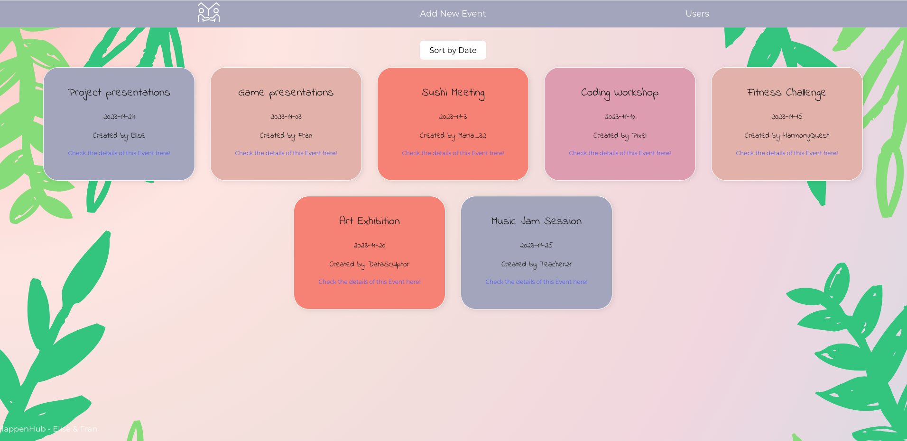
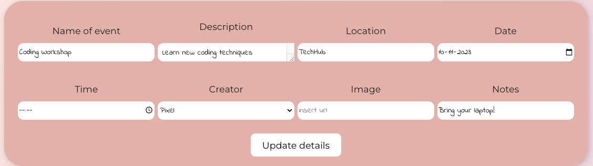
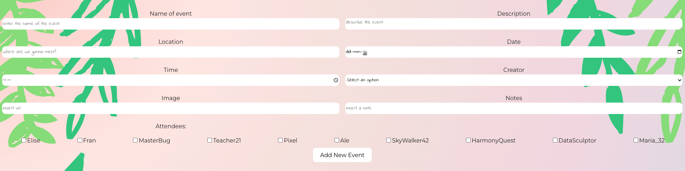
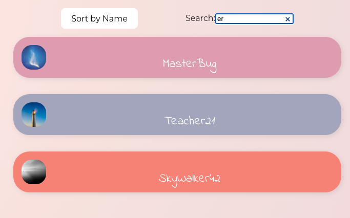
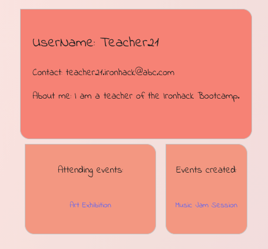

# Project 2 | HappenHub

## Introduction
HappenHub is developed for project 2 of the Web Development Ironhack Bootcamp (cohort October 2023, remote). The project is down based on pair programming and it's performed by Fran Martinez and Elise Jonkers. The app is developed using React, JSX, Vite, CSS, Next.js.

## Setup
In order to run the application on your computer, you should follow these steps:
- Fork this repo
- Clone this repo
- Open the code and run the following in the terminal:
1. npm install
2. create a folder called '.env' and paste `VITE_API_URL="https://happenhub.adaptable.app/"`
3. npm run dev

## App overview and user instructions
### Header 
The header is always shown on every page and it has three functionalities:
1. Home icon (left): if the user clicks on the Home icon, it will redirect to the HomePage
2. Add New Event (center): if the user clicks on 'Add New Event', it will redirect to the form to add a new event
3. Users (right): if the user clicks on 'Users', it will redirect to the UsersPage 

### HomePage
HappenHub is providing you with an overview of events of a group of people. On the HomePage the events will be displayed on seperated, colored boxes. Every event is showing some basic information like the title, date and creator of the event. Underneath the header at the center top of the page, there's a button 'Sort by Date'. If the users clicks on this button, the events are sorted by date. 

At the bottom of each event box, the user can click on 'Check the details of this Event here!'. This will redirect the user to the EventDetailPage of this specific event. 

### EventDetailPage
The EventDetailPage renders specific information and has multiple functionalities for an event. 

#### Event details
In this box the user can see the details of the clicked event. On the right side it is showing an image. If there's no image uploaded, it's going to show a random image. On the left side it's showing the title, description, location, date, time, creator, notes and attendees of the event. The user can click on the name of the creator and it will redirect the user to the details of this user (see UserDetailPage).

Underneath the event details there are two buttons the user can click on. 'Back to events' will redirect the user to the HomePage. 'Delete this event' will delete the event from the API. 

#### Comments
This box shows comments made by other users. If there are no comments it displays 'No comments yet'. There are two buttons underneath this box. If the user clicks on 'Show comments' the comments will be displayed. If the user clicks on 'Add comment' the box is rendering a form. In the first input the user can select his name. In the second input the user can type a comment. When the users clicks on the button 'Submit comment' it will save the comment. 

#### Edit the event
This box contains a form where the user can edit the current event. There are 8 fields the user can fill in and most of the fields are already pre-filled with the current information. The can decide to:
1. Name of event: the user can type the new name of the event. If he doesn't change anything, the current name of the event will be saved
2. Description: the user can type the new description of the event. If he doesn't change anything, the current description of the event will be saved
3. Location: the user can type the new location of the event. If he doesn't change anything, the current location of the event will be saved
4. Date: the user can select the new date of the event. If he doesn't change anything, the current date of the event will be saved
5. Time: the user can select the new time of the event. If he doesn't select anything, there won't be a time saved for this event
6. Creator: the user can type the new creator of the event. If he doesn't change anything, the current creator of the event will be used
7. Image: the user can type the new URL of the image of the event. If he doesn't change anything, a random image of the event will be used
8. Notes: the user can type the new notes of the event. If he doesn't change anything, the current notes of the event will be used
If the user clicks on the button 'Update details', the details of the event will be updated. 

### Add New Event
This page shows a form where the user can create a new event. The form has 9 fields:
1. Name of event: the user can type the name of the new event
2. Description: the user can type the description of the new event
3. Location: the user can type the location of the new event
4. Date: the user can select the date of the new event
5. Time: the user can select the time of the new event
6. Creator: the user can select the name of the creator of the new event
7. Image: the user can paste the URL of an image of the new event
8. Notes: the user can type notes for the new event
9. Attendees: the user can select the names of the people who are going to attend the event
When the user has filled in the correct information, he can click on the button 'Add New Event' and the new event is created. The user will be redirected to the detail page of the new event. 

### Users
This page shows on overview of the users of the group. The user can sort the names of the group by clicking on the button 'Sort by name' (center-left). The user can also search for a name by typing in the searchbar (center-right). Underneath these functionalities the users of the group are displayed in a column. If the user clicks on the box of a specific user, it will redirect to the detail page of this user.

### User Details
This page will show more details about a specific user. The page can display three boxes:
1. Personal details: this box will show the username, contact (emailaddress) and a 'About me'.
2. Attending events: this box will show a list of event which this current user will attend. The names of the events are displayed. The user can click on the name and it will redirect to the EventDetailPage of this specific event. If the user won't attend any events, this box is not visible.
3. Created events: this box will show a list of event that this current user has created. The names of the events are displayed. The user can click on the name and it will redirect to the EventDetailPage of this specific event. If the user didn't create any events, this box is not visible.

## Demo
Visit the following URL to use the app: https://effervescent-capybara-cdf4df.netlify.app 
